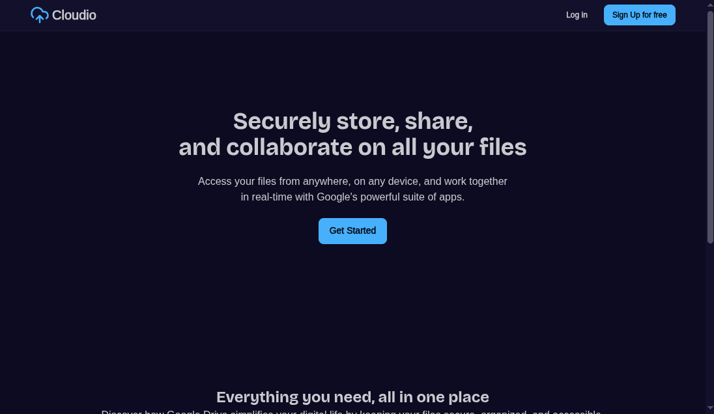
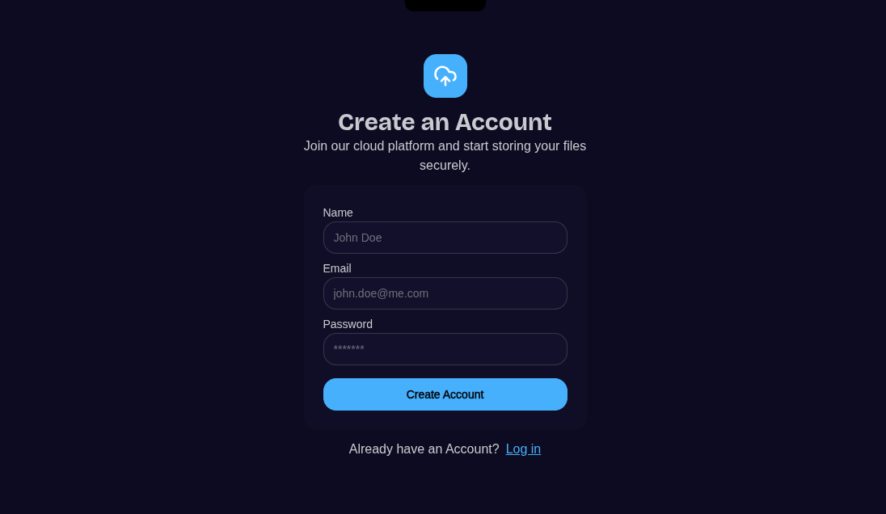
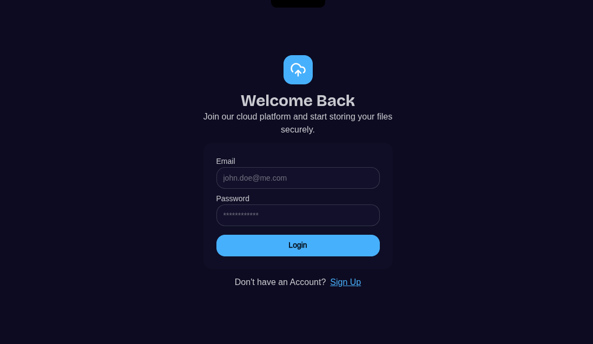
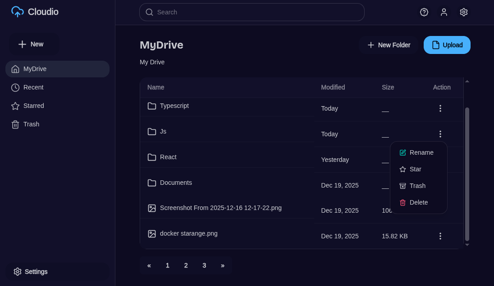
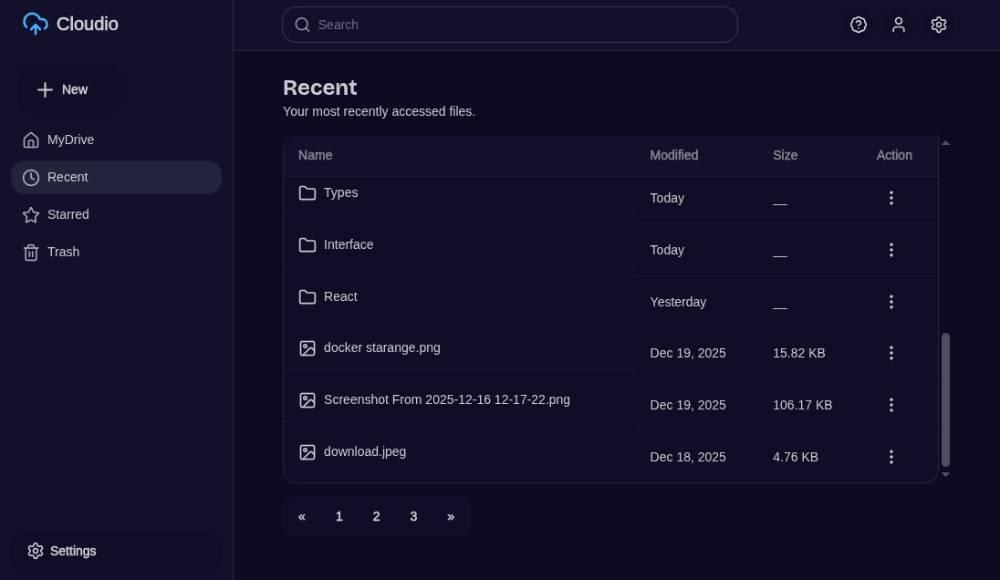
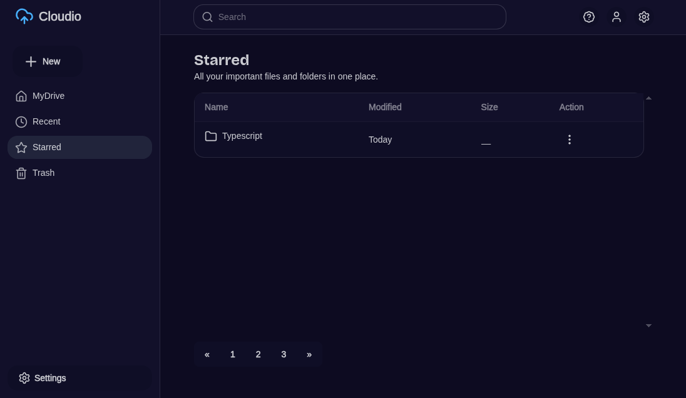
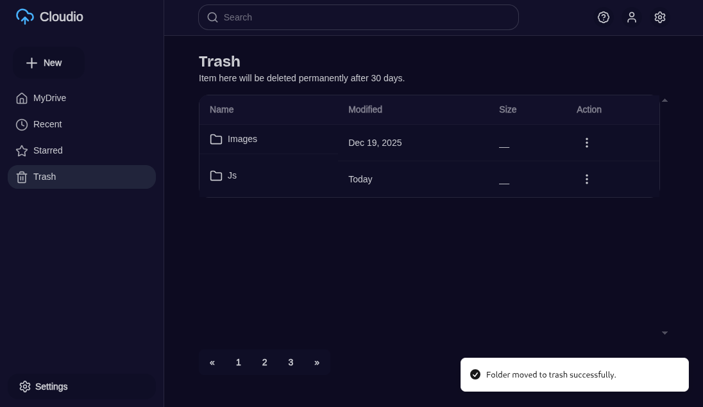

# ☁️ Cloudio

> **Cloudio** is a Google Drive–like cloud storage application focused on **images and folders only**.
> It delivers a clean, fast, and developer‑friendly experience for organizing visual assets with folders, starring, trash, and activity tracking.

Built as a **full‑stack production‑ready project**, Cloudio demonstrates real‑world architecture, scalable APIs, and modern frontend state management.

---

## ✨ Why Cloudio?

- 📸 **Images-first cloud storage** (no docs, no noise)
- 📂 Clean **folder-based organization**
- ⭐ Powerful **star & favorites system**
- 🗑️ **Trash with restore & permanent delete**
- 🕒 **Recent activity tracking**
- 🔐 Secure authentication with JWT
- 📊 **User storage usage insights**

This project is ideal for learning how large-scale file systems like Google Drive work — but with a focused, simplified scope.

---

## 🧱 Tech Stack

### Frontend

- **React.js**
- **TypeScript**
- **Axios**
- **TanStack Query (React Query)**
- **Tailwind CSS**
- **daisyUI**

### Backend

- **NestJS** with TypeScript
- **Custom Authentication System**
- **JWT (Access Tokens)**
- **MongoDB + Mongoose**

---

## 🔐 Authentication & User Management

- User signup
- User login
- Get current authenticated user profile
- View user storage usage

---

## 📁 File Management (Images Only)

- Upload image files
- List all files
- Get file details by ID
- Update file metadata
- Permanently delete files

---

## ⭐ File Organization & Status

- Star files
- Unstar files
- View all starred files

---

## 🗑️ Trash & Recovery (Files)

- Move files to trash
- Restore files from trash
- View trashed files

---

## 📂 Folder Management

- Create folders
- List all folders
- Get folder details by ID
- Update folder details
- Delete folders

---

## ⭐ Folder Organization & Status

- Star folders
- Unstar folders
- View starred folders

---

## 🗑️ Trash & Recovery (Folders)

- Move folders to trash
- Restore folders from trash
- View trashed folders

---

## 🧹 Trash Maintenance

- Empty trash (permanently delete all trashed files & folders)

---

## 🕒 Activity & Navigation

- View recently accessed files & folders

---

## 📌 Overall Product Capabilities

- Cloud image storage
- Folder-based organization
- Starred (favorites) system
- Soft delete with restore
- Permanent deletion
- Storage usage tracking
- Recent activity tracking
- Smart pagination

---

## 📄 Application Pages

### 🏠 Home Page



---

### 📝 Sign Up Page



---

### 🔑 Login Page



---

### ☁️ My Drive



---

### 🕒 Recent



---

### ⭐ Starred



---

### 🗑️ Trash



---

## 🧠 Architecture Highlights

- **Separation of concerns** between frontend & backend
- **JWT-based auth flow** with protected routes
- **Soft delete strategy** for files & folders
- **Optimistic UI updates** using TanStack Query
- **Reusable API & UI abstractions**

---

## 🚀 Getting Started (Local Setup)

```bash
# Clone repository
git clone https://github.com/brijeshdevio/cloudio.git

# Frontend
cd web
pnpm install
pnpm dev

# Backend
cd server
pnpm install
pnpm start:dev
```

> Make sure MongoDB is running and environment variables are configured.

---

## 🧪 Project Status

✅ Core features completed
🚧 UI polish & enhancements ongoing

---

## 🙌 Inspiration

Inspired by **Google Drive**, but redesigned for:

- simplicity
- images-only workflows
- clean UX
- learning real-world backend systems

---

## 📬 Feedback & Contributions

Feedback, suggestions, and contributions are welcome.
If you found this project useful, consider ⭐ starring the repository.

---

**Built with ❤️ to understand how real cloud storage systems work.**
